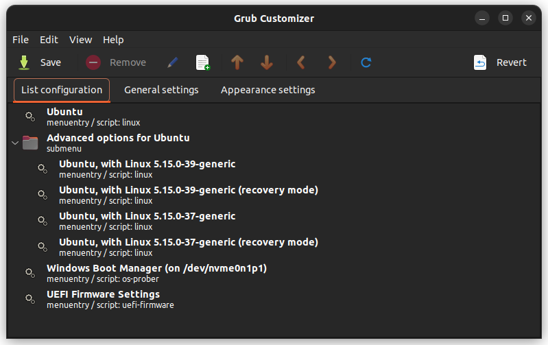

Before we begin, some background is probably needed. Recently, I was testing Ubuntu 25.04 to see if I wanted to upgrade to it. Deciding the update wasn't for me, I restarted and tried to boot back into my main Ubuntu installation.

I had installed Ubuntu 25.04 to a new partition so I could run it (or so I thought) alongside my main Ubuntu partition, however, in my naivety, I had let it **overwrite** the EFI partition during the installation 🤦. I was stuck with a GRUB menu that didn't have an option for my main Ubuntu partition!

Despite nearly 10 years as a Linux user, I've avoided messing with GRUB as it feels a bit archaic and generally lacks *good* resources for dealing with issues. Consequently, I've tended toward just reinstalling the Linux OS instead (I know, I know).

In this case, reinstalling wasn't really an option, so I started flailing around with random solutions from Stack Overflow - probably a familiar experience for most Linux users.

## Fixing the missing menu option

Before we get started, I should caveat this isn't an optimum solution, but it worked for me.

As I was missing the GRUB menu option, I theorised that I could reverse-engineer the required menu option using the new Ubuntu 25.04 partition's menu option.

To do this, I installed Grub Customizer:

```shell
sudo add-apt-repository ppa:danielrichter2007/grub-customizer
sudo apt update
sudo apt install grub-customizer
```

Grub Customizer is a simple GUI app that looks something like this:



This was theoretically as simple as copying and tweaking the existing Ubuntu menu option. However, things were harder for myself as I was using an LVM volume for my main Ubuntu partition.

With a little help from ChatGPT, I pulled together a new entry with a boot sequence that looked something like this:

```
recordfail
load_video
gfxmode $linux_gfx_mode
insmod gzio
if [ x$grub_platform = xxen ]; then insmod xzio; insmod lzopio; fi
insmod part_gpt
insmod lvm
insmod ext2
search --no-floppy --fs-uuid --set=root [root partition uuid]
linux	/boot/vmlinuz-[version]-generic root=/dev/mapper/ubuntu-root ro  quiet splash $vt_handoff
initrd	/boot/initrd.img-[version]-generic
```

Notably, I had:

- Added the `insmod lvm` line
- Changed `search --set=root [uuid]` to reference the root partition UUID. You can use `sudo blkid` to identify this, but you may need to activate the volume group first - see below
- Changed `linux /boot/vm-linuz-[version]-generic` to reference the correct kernel version
- Changed `initrd	/boot/initrd.img-[version]-generic` to reference the correct initial RAM disk version

### Mounting the LVM partitions

The kernel / initrd version were found by mounting the Ubuntu LVM root partition and looking inside `/boot`.

You can mount the LVM root partition by running:

```shell
ls -al /dev/mapper
sudo mount /dev/mapper/ubuntu-root /mnt
```

If you need to, substitute `/dev/mapper/ubuntu-root` with whatever your root partition is from the output of `ls -al /dev/mapper`.

### Saving the menu option

After saving my Grub Customizer changes and restarting, the menu option didn't actually work! Nothing ever works first time in Linux of course.

Luckily for me, it seemed that Grub Customizer had 'refreshed' the menu options as there were now additional menu options for my main Ubuntu partition that did work!

It wasn't elegant, but I managed to fumble into a solution by accident. A win's a win 😄

I suspect that what actually happened is Grub Customizer runs an `update-grub` which added the extra options (more on this later).

### What a working menu option looks like

For anyone interested, a working menu option that's been generated by Ubuntu looks something like:

```
recordfail
load_video
gfxmode $linux_gfx_mode
insmod gzio
if [ x$grub_platform = xxen ]; then insmod xzio; insmod lzopio; fi
insmod part_gpt
insmod lvm
insmod ext2
set root='lvmid/[volume group uuid]/[logical group uuid]'
if [ x$feature_platform_search_hint = xy ]; then
  search --no-floppy --fs-uuid --set=root --hint='lvmid/[volume group uuid]/[logical group uuid]'  [root partition uuid]
else
  search --no-floppy --fs-uuid --set=root [root partition uuid]
fi
linux	/boot/vmlinuz-[version]-generic root=/dev/mapper/ubuntu-root ro  quiet splash $vt_handoff
initrd	/boot/initrd.img-[version]-generic
```

Some notable differences with my original attempt:

- There's an extra `set root=` line
- It uses volume and logical group UUIDs, which you can get by running `sudo vgdisplay` and `sudo lvdisplay` respectively
- There's an extra `if` clause around finding the root partition, presumably for extra robustness

## Reinstalling GRUB entirely

After booting back into my main Ubuntu partition, I decided to delete the unneeded Ubuntu 25.04 partition and clean things up.

Unfortunately, I didn't expect that upon rebooting, the GRUB menu would be completely broken and I was met with the GRUB CLI instead 😬.

If you've also been in the situation - fear not! There is a fairly straightforward way out of this situation.

The credit mostly goes to this fantastic [Stack Overflow answer](https://askubuntu.com/a/88432) which outlines things succinctly. I've just added any details that were relevant to my particular experience.

Note that it *may* be possible to fix this within the GRUB CLI too, but the solution I'm about to explain involves booting into a Ubuntu live USB and working from there.

### Reinstalling GRUB via live USB

Boot into your Ubuntu live USB and proceed to mount the Ubuntu LVM root partition to `/mnt`. This will look something like:

```shell
ls -al
sudo mount /dev/mapper/ubuntu-root /mnt
```

Similar to when we mounted the root partition (see earlier section), you can substitute `/dev/mapper/ubuntu-root` with whatever your root partition is from the output of `ls -al /dev/mapper`.

Proceed to mount the EFI partition to `/mnt/boot/efi`:

```shell
sudo blkid
sudo mount /dev/nvme0n1p1 /mnt/boot/efi
```

Substitute `/dev/nvm0n1p1` with whatever your EFI partition is from the output of `sudo blkid`.

This is where things get interesting. We're going to use `chroot` to access the Ubuntu root partition and allow us to run commands inside of it, and not on our live USB!

To do this, we need to mount some additional Ubuntu-specific directories to `/mnt`:

```shell
for i in /sys /proc /run /dev; do sudo mount --rbind "$i" "/mnt$i"; done
```

Now we need to `chroot` into the mounted root partition:

```shell
sudo chroot /mnt
```

You should observe that the user changes to a `root` user inside of the mounted partition.

Finally, we just need to reinstall and update GRUB:

```shell
grub-install /dev/nvm0n1
update-grub
```

Substitute `/dev/nvm0n1` with whatever your disk name is - you can use `sudo fdisk -l` to get this.

At this stage, assuming you haven't seen any errors, you should double-check that the EFI partition UUID hasn't changed. You can do this by:

```shell
blkid | grep -i efi
grep -i efi /etc/fstab
```

If the UUID in `blkid` and `/etc/fstab` differ, change `/etc/fstab` to use the new UUID from `blkid`.

Now, exit the `chroot` and reboot:

```shell
exit
reboot
```

If all has gone well, you should be greeted with a working GRUB menu with options for the Ubuntu partition 🥳

## Bonus - How does GRUB actually work?

After doing a little bit of research (with ChatGPT), the bootloading process seems fairly straightforward:

1. **UEFI firmware loads GRUB**
   - Your PC starts and the BIOS/UEFI looks for a bootable device
   - It finds your disk’s **Master Boot Record (MBR)** or **EFI System Partition (ESP)** and loads GRUB from there
2. **GRUB Stage 1**
   - Minimal stage which loads the **core GRUB modules** and hands off to them
3. **GRUB Stage 2**
   - Loads full GRUB, including filesystems and configuration from `/boot/grub/grub.cfg`
   - Displays the GRUB menu: lets you pick between kernels or OSes
4. **Kernel and initial RAM disk**
   - GRUB loads the Linux kernel (e.g., `/boot/vmlinuz-6.14.0-23-generic`) and the **initial RAM disk (initrd)**
   - Passes control to the kernel with boot parameters (like `root=UUID=...`)
5. **Linux takes over**
   - The kernel mounts the root filesystem, starts systemd, and continues with the normal Ubuntu boot process

Notably, the UEFI firmware exists on the motherboard and stores a **boot order list** in non-volatile memory (NVRAM). This list contains the entry points on the EFI partition, which may look like:

- Ubuntu’s GRUB: `\EFI\ubuntu\grubx64.efi`
- Windows Boot Manager: `\EFI\Microsoft\Boot\bootmgfw.efi`

You can even view this boot order list in Ubuntu:

```shell
sudo efibootmgr
```

This outputs something like:

```
BootCurrent: 0001
BootOrder: 0001,0000
Boot0000* Windows Boot Manager
Boot0001* ubuntu
```

In this example, we can see that `ubuntu` is configured to run first. It's the reason that once you install Ubuntu on a dual-boot setup, you see the GRUB bootloader instead of the Windows Boot Manager!

I'll probably never understand GRUB or bootloaders at an expert level, but it's nice to leave this experience with a bit more knowledge of a fundamental piece of software I use daily (with the occasional bit of friction).
