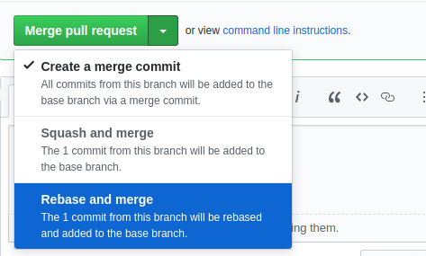

If you're a developer reading this, you're most likely familiar with Git. It's probably the tool you use most next to your text editor, but also the one you're least familiar with. You're probably not alone as many developers don't seem to take the time to develop the skills to use it effectively.

In this post, I'll go over the ways I use Git and hopefully this can help you get better at using it with a minimal amount of effort. Disclaimer - I don't profess to be an expert in Git, but over the years I've figured out how to get the most out of it for my workflow. Depending on your workflow, some of these tips might not work well, but I believe they should be useful in the majority of cases.

## Pull changes correctly

> **tldr** - Use `git pull --rebase` (`gup` when using Oh My Zsh) to pull new changes on a branch.

Suppose you're working on an unprotected branch (you can push commits directly onto it) with multiple people e.g. `master`. Assume that one of your colleagues has pushed some new commits since the last time you did a `git pull`. You try to `git push` and you get the following:

```
error: failed to push some refs to 'git@github.com:your-repo/your-repo.git'
hint: Updates were rejected because the tip of your current branch is behind
hint: its remote counterpart. Integrate the remote changes (e.g.
hint: 'git pull ...') before pushing again.
hint: See the 'Note about fast-forwards' in 'git push --help' for details
```

Instinctively, you run a `git pull` (the prompt even tells you to!). You've probably even habitualised this and do it without thinking. If there weren't any merge conflicts, Git magically sorts things out and then you can `git push` successfully. End of the story right?

Unfortunately, no. If we look at the commit history we'll see something like the following:

```
* ed10c57bc - Merge branch 'master' of github.com:test/test into master
|\
| * 0d4f8bce2 - My commit
* | 2a95c660a - Colleague's commit
|/
* 585b1b3e9 - Some other commit
```

We can see what looks like a hairpin loop in the history and a merge commit which says that the branch was **merged into itself**. If you take a second to think about this, it was probably not what you were trying to achieve when you went to push your code.

When working on smaller projects this might be fine, but on larger projects, many people doing this exact same pattern can quickly make the commit history into a thick forest of branches. Commit histories like this are nearly guaranteed to make your life unnecessarily hard further down the line when you're trying to figure out why a change was made.

What to do instead?

The simple fix is to use `git pull --rebase` instead. This change means that the commit history now looks like:

```
* 0d4f8bce2 - My commit
* 2a95c660a - Colleague's commit
* 585b1b3e9 - Some other commit
```

This is a massive difference, and it is instantly clear what is happening. No more hairpin loop or
merge commit.

I use [Oh My Zsh](https://github.com/ohmyzsh/ohmyzsh), and use its handy `gup` alias for doing this. You can also configure Git to use this by default by running `git config --global pull.rebase true`. If you're using IntelliJ, you can set `Settings > Version Control > Git > Update method` to 'Rebase'.

## Rebase instead of merge

> **tldr** - Use `git rebase` (`grb` when using Oh My Zsh) to pull in new changes from a parent branch, or change the parent branch completely. Avoid rebasing branches other people are working on.

We've talked about using rebasing in the context of a `git pull --rebase`, but it can also generally be used as a substitute for a `git merge`. Typically, we need to merge when working on a feature branch and need new changes from the parent branch. Inversely, we might need to merge a pull request (PR) from the feature branch into the parent.

Both of the above cases would result in merge commits in our commit history. For example, say we're working on a branch called `your-branch` and want changes from `master`. Most people will probably use `git merge master` and inadvertently create a commit history like the following:

```
* ed10c57bc - Merge pull request #1 from test-repo/your-branch
|\
| * 0d4f8bce2 - Commit on your-branch
* | 2a95c660a - Commit on master
| * 6a2416680 - Merge branch 'master' into your-branch
|/|
* | 585b1b3e9 - Commit on master
| * 217dd11cf - Commit on your-branch
```

This is quite confusing to look at. Notice that we now have **two** hairpins because we have the additional merge commit at `6a241668` where we merged in master's changes.

If we use `git rebase master` instead, we can avoid the merge commit and get the following:

```
* ed10c57bc - Merge pull request #1 from test-repo/your-branch
|\
| * 0d4f8bce2 - Commit on your-branch
| * 217dd11cf - Commit on your-branch
* | 2a95c660a - Commit on master
* | 585b1b3e9 - Commit on master
| |
```

This is definitely an improvement as we've removed the unnecessary merge commit. We could stop here, but there are people that advocate going further to rebase the _entire_ PR branch onto the master branch. On GitHub, this is possible using the 'Rebase and merge' option:



This is somewhat advantageous in that you get a linear commit history with the least noise possible:

```
* 0d4f8bce2 - Commit on your-branch
* 217dd11cf - Commit on your-branch
* 2a95c660a - Commit on master
* 585b1b3e9 - Commit on master
```

Unfortunately, the downside is that we lose the extra information from the PR's merge commit. These merge commits typically link to the PR description, which can often provide additional context that the commits lack.

What you choose is ultimately up to you, but I'd advise only rebasing simpler PRs where the merge commit wouldn't provide any additional information.

## Pushing correctly when rebasing

> **tldr** - Use `git push --force` to push your rebased changes to your remote branch. Avoid using this if you're working on a branch that is shared by other people.

It's important to understand that rebasing **changes** your commit history whilst merging **does not**. Usually a rebase will involve rewriting your commits so that they were created at the time the command was run. Suppose we have some commits like the following:

```
* 0d4f8bce2 - My commit 1 (1 day ago)
* 2a95c660a - My commit 2 (2 days ago)
```

Upon doing a `git rebase` the history might look like:

```
* 993e0b281 - My commit 1 (1 minute ago)
* c76293c19 - My commit 2 (1 minute ago)
```

You should notice that the commit hashes and timestamps have changed. Normally this isn't a problem as we're unlikely to be interested in preserving the exact creation times.

If you've previously pushed these commits up to the remote branch, doing a `git push` will get you the following:

```
error: failed to push some refs to 'git@github.com:your-repo/your-repo.git'
hint: Updates were rejected because the tip of your current branch is behind
hint: its remote counterpart. Integrate the remote changes (e.g.
hint: 'git pull ...') before pushing again.
hint: See the 'Note about fast-forwards' in 'git push --help' for details.
```

This should look familiar. Run a `git status`, and you should see:

```
On branch your-branch
Your branch and 'origin/your-branch' have diverged,
and have 2 and 2 different commits each, respectively.
  (use "git pull" to merge the remote branch into yours)
```

Git is telling us that your local branch and the remote branch have diverged. This is understandable as we changed the commit history on the local branch. If we were to naively follow the advice of running `git pull`, the commit history would look like:

```
* 993e0b281 - My commit 1 (1 minute ago)
* c76293c19 - My commit 2 (1 minute ago)
* 0d4f8bce2 - My commit 1 (1 day ago)
* 2a95c660a - My commit 2 (2 days ago)
```

This is definitely not what you want as the commits have been repeated!

So what do we need to do?

Instead of trying to `git push`, just use `git push --force` instead. This will forcibly push up the local branch's changes to the remote branch and override its commits. We are telling Git to accept our local branch's version of the commit history as the source of truth.

### Word of warning

`git push --force` is a potentially dangerous command. Normally it isn't a problem because you will use it on a branch you created and no one else is working on it.

Now imagine you're working on a branch with someone. They push commits to the remote branch, and you haven't pulled those changes down into your local branch. You decide to rebase and then force push. Doing this will erase the other person's commits on the remote branch and this _could_ potentially be irreversible.

It's entirely possible to sort this out after the fact, but it can feel like a lot of trouble and is potentially asking for annoyed teammates.

A good rule of thumb is to not use `git rebase` when you're working on a shared branch (you can still use `git pull --rebase`). This way you won't need to `git push --force` either.

## Safely rebase dependent branches

> **tldr** - Use `git rebase --onto` to rebase a branch onto its dependent branch safely.

On occasions, you may end up with a branch that depends on another branch that hasn't been merged into the main branch. It might look the following:

```
featureB -> featureA -> master
```

In the above example, how would we get changes from `master` onto `featureB`? Given our earlier advice, we could try:

1. `git rebase master` (on `featureA`)
2. `git rebase featureA` (on `featureB`)

This approach would work well with `git merge`, but unfortunately won't work with `git rebase`. Upon running the second rebase, we'll find that we either get stuck during the rebase or end up with a bunch of duplicated commits from `featureA`.

Our problem is that the first rebase has changed the commit history and `featureA` is no longer associated to its previous commits. When we switch to `featureB`, the previous `featureA` commits are now associated with `featureB` instead. This leads to difficulty when rebasing in such a manner.

Thankfully, the solution is fairly straightforward - we should use `git rebase --onto` instead. From the `featureB` branch, we would use it like so:

```
git rebase --onto=featureA featureA@{1} featureB
```

The `--onto` flag tells Git that we want to move a range of commits onto `featureA`. The range of commits is specified by the next two arguments. The first argument is the base commit, and the second argument is the last commit.

The base commit is the commit _prior_ to the commit you want to move. For example, given the following commits:

```
A - B - C - D
```

If we wanted to move commits B, C and D onto another branch, we would use:

```
git rebase --onto=target-branch <commit A> <commit D>
```

We could substitute commit hashes directly into the placeholders for commit A and D into the above, but can also use commit aliases.

In our earlier example, we've used `featureA@{1}` as the base commit. This is an alias for the previous head commit of `featureA` before it was rebased. We've also used `featureB` for the last commit, as this is an alias to the head commit for `featureB`.

I personally prefer to use an explicit commit hash for the first commit. Sometimes the `@{1}` alias doesn't work if you've made additional changes to the dependent (i.e. `featureA`) branch.

## Cleanup your commit history

> **tldr** - Use `git rebase -i` (`grbi` when using Oh My Zsh) to cleanup your branch's history. `git commit --amend` (`gca!` when using Oh My Zsh) is great for changing the most recent commit.

As we've learnt earlier, `git rebase` is able to change a branch's commit history. One interesting flag we can use with it is `-i`. It stands for 'interactive' and can be used to interactively rewrite the commit history.

For example, if we want to change the last 2 commits on our branch we can do `git rebase -i HEAD~2`. This will show us the following interface in the CLI:

```
pick dca657264 Another commit
pick ad8830adf Some commit

Rebase 5b95f1854..ad8830adf onto 5b95f1854 (2 commands)
#
# Commands:
# p, pick <commit> = use commit
...
```

The interface offers a bunch of options, but the ones I commonly use are:

- Pick - continue to use the commit as-is
- Reword - change the commit message
- Edit - edit the commit contents
- Squash - merges the commit into the previous commit, squashing it

This is a great way to tidy up a feature branch before submitting a PR for it. For example, the branch's commit history might look like this:

```
* 2a95c660a - Fix typo in feature
* dca657264 - Add other part of feature
* 0d4f8bce2 - Format feature code
* ad8830adf - Add feature
```

Commits like 'Fix typo' or 'Format code' have limited value, and are particularly worthless if they're just fixing new code that should be working in the first place.

In general, it's not good practice to commit code in a broken state, but this can contradict other advice to make frequent, smaller commits. By using `git rebase -i` we can have the best of both worlds. We can create frequent WIP commits and then clean up the commit history later, perhaps before submitting the PR.

### Changing the most recent commit

Whilst `git rebase -i` is a great general purpose command, I find it goes through a bit too much ceremony when I simply want to change the most recent commit. For this purpose, we can use `git commit --amend` instead (`gca!` when using Oh My Zsh). It allows us to change the most recent commit with whatever is currently staged, and even the commit message.

## Create partial commits

> **tldr** - Use a commit GUI to select specific lines and files for a commit. Try to keep commits as tight in scope as possible.

When working on new features, it's easy to end up making lots of changes without really thinking about how the commits will look. In general, it's advisable to make frequent, narrowly scoped commits, but many people end up with some combination of the following:

- WIP commits that may leave the project in a completely broken state
- Commits that do too many things simultaneously
- Broad commits like 'Format code' or 'Fix tests'

It can be hard to craft a commit history that makes sense. Complicated features can necessitate trial and error and often involve churn. This is a natural part of the development cycle, but we can still try to organise the chaos.

One thing I do to improve the scope of my commits is to use a GUI to select specific lines or files to include. In IntelliJ, the commit GUI is available via `Ctrl + K` or `VCS > Commit`.


This allows me to (usually) work in a more unorganised way, and then think about the commit structure a little later. For bigger features, I may end up chopping it up into several commits. This is much better than a single, amorphous blob of changes where I can't easily describe what changed in the commit message.

## Write better commit messages

> **tldr** - Aim to make the subject line around 50 characters. Add detailed descriptions to the message body when possible. Wrap body lines at 72 characters. Use a commit GUI to help with these.

If you've been following up to now, my tips should hopefully have got you some way to writing better commit messages already. By structuring commits and their content better, we should find that we write more refined messages as a side effect.

Unfortunately, writing a good commit message is fairly subjective and could probably warrant its own blog post. Thankfully there's already some good advice out there. Chris Beams' fantastic post on [How to Write a Git Commit Message](https://chris.beams.io/posts/git-commit/) is my usual recommendation. I've boiled it down to these main points:

- The subject (or initial) line should aim to be around 50 (or max 72) characters
- Use the imperative mood for the subject line i.e. 'Add' instead of 'Added' or 'Adding'
- Add a commit description to the body to provide more context about the commit
- Body lines should wrap at 72 characters

I would highly recommend giving it a read as it goes into much more detail about the why. A decent commit GUI should help you with following the 72 character limit and wrapping lines correctly. In IntelliJ you can find these settings under `Settings > Version Control > Commit > Commit message inspections`.


If you need convincing that commit messages are important, you should try to think about commits as documentation for your colleagues and future self to use. There's a bit of an upfront cost to writing it, but it can avoid many hours of wasted effort in trying to understand why a change was made. Peter Hutterer [sums this up](http://who-t.blogspot.com/2009/12/on-commit-messages.html) nicely:

> Re-establishing the context of a piece of code is wasteful. We can’t avoid it completely, so our efforts should go to [reducing it](http://www.osnews.com/story/19266/WTFs_m) [as much] as possible. Commit messages can do exactly that and as a result, _a commit message shows whether a developer is a good collaborator_.

## Use Conventional Commits

> **tldr** - Use the [Conventional Commits](https://www.conventionalcommits.org/) format. If your project allows it, you can use it to automate change logs and semantic version bumps based on commits.

Hopefully by now you should be equipped with the knowledge to author good commit messages, but what if we could take it even further to the **real** endgame.

To make commit messages the best they can be, we have the [Conventional Commits](https://www.conventionalcommits.org/) specification. It prescribes the exact format that a commit message should take. The format was originally adopted from the Angular project and looks like the following:

```
feat(config)!: allow provided config object to extend other configs

BREAKING CHANGE: `extends` key in config file is now used for extending other config files
```

The main characteristics are:

- The commit has a type e.g. `feat` (feature). Other types like `fix`, `ci` and `test` can also be used
- The scope of the commit can be included in brackets i.e. `(config)`
- If there is a breaking change, it should be included in the message body or by using `!:` in the subject line

There is some wiggle room to change some of these parts, but ideally the format should be enforced by [linting](https://github.com/conventional-changelog/commitlint) rules in a pre-commit hook.

By using this commit format, we can access tooling to automate change log generation and semantic version bumps for your project. For example, `feat` commits since the last release will automatically trigger a minor version bump. This is recommended when using tools like [Lerna](https://github.com/lerna/lerna) and makes version management fairly trivial across a monorepo project.

Conventional Commits are probably the most useful for projects that are consumed e.g. libraries/frameworks, but I would still recommend using them for private ones too. As commit messages are treated as first-class citizens, it forces everyone to apply more discipline and hopefully create better commits.

## Final words

Whilst Git is a complicated tool, you can easily become proficient simply by acquiring these two skills:

- Understanding how to create and modify the commit history
- Writing good commit messages

Both of these may take a bit of time as they require you to habitualise new techniques that may not be immediately obvious. I encourage you to persevere! As your commits start to improve, your colleagues and future self will massively thank you when they next have to look at the commit history.
